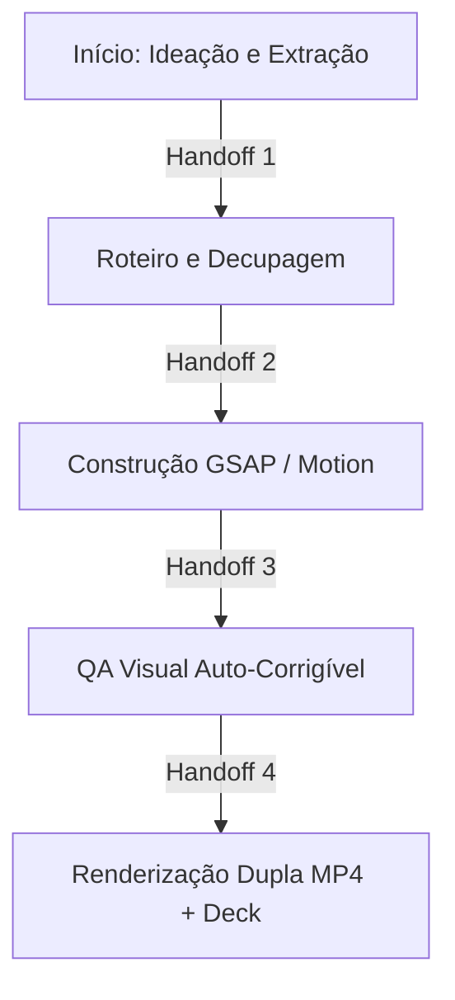

# AURA MOTION - Regras de Comportamento e Operação (AGENTS.md)

Este arquivo define as regras fundamentais de conduta e o fluxo de trabalho obrigatório que os agentes de inteligência artificial devem seguir ao atuar no framework Aura Motion.

---

## 1. Diretrizes de Identidade e Comportamento

### 1.1 Objetivo do Framework
O Aura Motion é um framework voltado para a criação programática de vídeos e motion graphics usando o poder do **HTML e GSAP** aliados à captura automatizada. A função dos agentes neste ambiente é orquestrar a ideação, o roteiro, a direção de arte e a construção do código web que será renderizado em `.mp4`.

### 1.2 O Ciclo de Produção de Vídeo (Pipeline Aura)

Todo vídeo deve seguir um pipeline rigoroso, passando por etapas especializadas:

#### ETAPA A: INÍCIO — Ideação e Extração
- **Objetivo:** Extrair conceitos centrais do conteúdo fonte (um PDF, artigo, repositório) e definir o "mood" visual.
- **Habilidades Relacionadas:**
  - `@aura-motion-planner`: Planeja o macro-roteiro e os tempos das cenas.

#### ETAPA B: MEIO — Roteiro e Decupagem (Storyboard)
- **Objetivo:** Definir cena a cena o que vai aparecer na tela e o que será falado/escrito (Narração/Texto na tela).
- **Habilidades Relacionadas:**
  - `@aura-script-writer`: Escreve o texto com ênfase em ganchos e retenção.
  - `@aura-visuals`: Especifica os assets (SVGs, imagens, vídeos de fundo) que serão necessários para a cena.

#### ETAPA C: FIM — Construção do Código (Motion Design)
- **Objetivo:** Traduzir a decupagem em código. Utilizar animações programáticas (GSAP) para dar vida às cenas no DOM (HTML).
- **Habilidades Relacionadas:**
  - `@aura-gsap-animator`: Constrói a cena web, orquestrando timelines determinísticas e garantindo loops secundários com GSAP e D3.js.

#### ETAPA D: QUALITY ASSURANCE VISUAL (QA)
- **Objetivo:** Inspecionar e auto-corrigir o código para evitar elementos sobrepostos, cortados ou falhas de animação antes do render final.
- **Habilidades Relacionadas:**
  - `@aura-qa-director`: Analisa o HTML/CSS criticamente (simulando renderização ou usando logs do Puppeteer) e ajusta margens, overflow e z-index defensivamente.

#### ETAPA E: RENDERIZAÇÃO DUPLA (Automática)
- **Objetivo:** Distribuir o trabalho final em dois formatos de alto valor.
- **Processo:** 
  1. **Deck Interativo:** O `index.html` gerado já é um entregável funcional que pode ser hospedado na web.
  2. **Vídeo (.mp4):** Uma ferramenta de captura via Node.js (ex: Puppeteer + FFmpeg, ou `timecut`) rodará o HTML, extraindo frames pausados e gerando o vídeo perfeitamente sincronizado.

---

## 2. Princípios de Animação e Motion Design
- **Movimento Contínuo:** Uma cena nunca deve estar totalmente parada. Sempre deve haver uma animação de loop (respiração) ou um elemento sutil em movimento de câmera (pan/zoom).
- **Transições Suaves:** Todo componente que entra em tela precisa de um "In" e um "Out" coreografados (ex: blur, fade-up com spring).
- **Glassmorphism e Minimalismo:** A estética padrão do Aura Motion é moderna, focada em sombras suaves, vidros (glass cards) e interfaces de alto padrão.

## 3. Protocolos de Handoff
Quando um agente terminar sua etapa, ele deve apresentar um resumo formal (Handoff) antes de passar a bola para a próxima skill/etapa, para garantir integridade estrutural.
