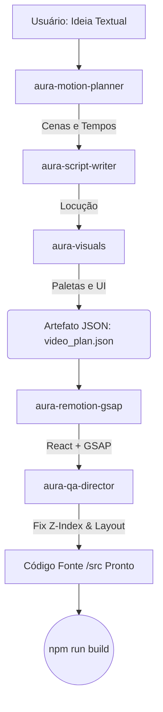

# Pipeline de Agentes de Inteligência Artificial

No **Aura Motion**, o fluxo de ideação criativa e engenharia de software é totalmente delegável a um enxame de agentes de Inteligência Artificial independentes operando na máquina do diretor de arte.

---

## O Ciclo da Criação

O pipeline ocorre através de **Passagem de Bastão (Handoff)**. Um agente não começa a trabalhar sem que o anterior tenha finalizado seu artefato canônico de contrato.



---

## 📄 O Contrato JSON (`video_plan.json`)

Para evitar alucinações na hora do robô de código ler o que os robôs criativos fizeram, forçamos que os agentes criativos exportem suas mentes no formato **JSON estrito**. 

*Nota de Engenharia Reversa (ver `_reversa_sdd/`)*: A decisão de trocar YAML/MD por JSON no handoff mitigou quebras de parsing no React.

Exemplo do Contrato de Handoff:
```json
{
  "tema": "A Revolução do React e GSAP",
  "fps": 30,
  "cenas": [
    {
      "id": "cena-01",
      "duracao_segundos": 3,
      "locucao": "Renderizar vídeos na web era complexo.",
      "visual": {
        "fundo": "bg-slate-900",
        "tipografia": "text-white text-5xl",
        "iconografia": "lucide-triangle-alert"
      },
      "animacoes_esperadas": ["fade-in", "slide-up"]
    }
  ]
}
```

---

## Responsabilidade de Cada Agente

### 1. `aura-motion-planner`
Pega o tema principal e divide nos tempos corretos. Ele tem noções de retenção (cenas rápidas no início, mais calmas no meio).

### 2. `aura-script-writer`
Um mestre em copywriting (storytelling). Pega os "3 segundos" dados pelo planner e descobre o que pode ser narrado sem atropelar o ritmo fonético.

### 3. `aura-visuals`
Aplica a estética (ex: *Glassmorphism*). Troca fundos genéricos por gradientes baseados em HSL e escolhe os vetores que acompanham o texto. Fecha e assina o `video_plan.json`.

### 4. `aura-remotion-gsap`
A força braçal de engenharia. Lê o JSON fechado e converte os campos "fade-in" para lógicas complexas de referências `useRef` e `.to() / .from()` no GSAP injetadas dentro de componentes TSX do Remotion.

### 5. `aura-qa-director`
A rede de segurança. Se o Coder esquecer de setar um elemento invisível no frame 0 e ele "piscar" na tela antes da animação iniciar (FOUC), o QA lê o código, nota a ausência do CSS (ex: `opacity-0` do tailwind), faz o regex patch e avisa o diretor humano que está pronto.
