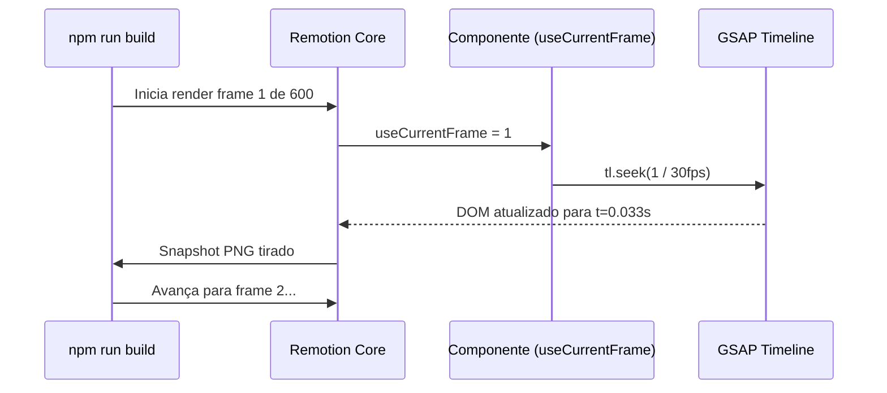

# Arquitetura do Sistema: Aura Motion

Bem-vindo ao **Aura Motion Architecture Document**. Aqui desvendamos a engenharia técnica de como geramos vídeos MP4 programaticamente através do framework React.

---

## 1. O Desafio (A Natureza do DOM vs MP4)

Tradicionalmente, a web (HTML/CSS) não foi desenhada para "gravação perfeita" frame a frame. Ferramentas que gravam a tela de um navegador muitas vezes pulam quadros (dropped frames) devido a lag do JavaScript. 

Para resolver isso, usamos o **Remotion**, que permite extrair exatamente 60 quadros visuais por segundo pausando e calculando cada cena. No entanto, o motor de animação corporativo mais poderoso da web é o **GSAP**, que roda baseado em um relógio próprio (`gsap.ticker`), independente do Remotion. Se não interviermos, os dois relógios brigam e o vídeo sai desincronizado.

## 2. A Solução (The Time Trick)

Desativamos o tempo nativo do GSAP e transformamos a timeline em uma matriz **estática**. O React passa a controlar manualmente para qual fração de tempo o GSAP deve olhar com base no frame exato da renderização do MP4.



### O Trecho de Código Canônico

Todo componente visual injetado na pasta `/src` pelo robô Coder obedecerá à seguinte estrutura abstrata:

```tsx
import { useEffect, useState } from 'react';
import { useCurrentFrame, useVideoConfig } from 'remotion';
import gsap from 'gsap';

// [1] Desligamos o relógio do GSAP globalmente
gsap.ticker.remove(gsap.updateRoot);

export const MinhaCena = () => {
    const frame = useCurrentFrame();
    const { fps } = useVideoConfig();
    const [tl] = useState(() => gsap.timeline({ paused: true }));

    useEffect(() => {
        // [2] O robô de IA escreve todas as lógicas de movimento no UseEffect
        tl.to(".title", { opacity: 1, duration: 1 });
    }, [tl]);

    useEffect(() => {
        // [3] Passagem de tempo rígida frame a frame
        tl.seek(frame / fps);
    }, [frame, fps, tl]);

    return (
        <div className="title" style={{ opacity: 0 }}>
            Render Perfeito!
        </div>
    );
}
```

---

## 3. Topologia e Árvore de Pastas

```text
aura-motion/
├── .agents/                 # Brain do Sistema
│   └── skills/              # Prompts e Agentes (reversa, planner, coder)
├── _reversa_sdd/            # Conhecimento Arquitetural (SDDs extraídos)
├── src/                     # Código fonte
│   ├── motions/             # 📁 Módulos de Animação (Organizados por Nome)
│   │   ├── intro-x/         # Cada animação ganha sua própria pasta
│   │   │   ├── index.tsx    # O componente Remotion (GSAP injection)
│   │   │   └── assets/      # SVGs e imagens isoladas desta animação
│   │   └── lower-third-y/   # Outra animação isolada
│   └── index.ts             # Registro central no Remotion
├── out/                     # 📁 Entregas Renderizadas (Export MP4)
│   ├── intro-x/             # Pasta da entrega 1
│   │   └── final.mp4
│   └── lower-third-y/       # Pasta da entrega 2
│       └── final.mp4
└── package.json             # Dependências core (Remotion, GSAP)
```

## 4. O Sistema de Estilização

Para reduzir alucinações de IAs codificadoras com CSS complexo, forçamos o uso do **Tailwind CSS**. A matriz de estilos (paletas, fontes) é definida pela skill `aura-visuals` (Diretor de Arte), que orquestra um arquivo de constantes lido pelos componentes dinâmicos do React.
