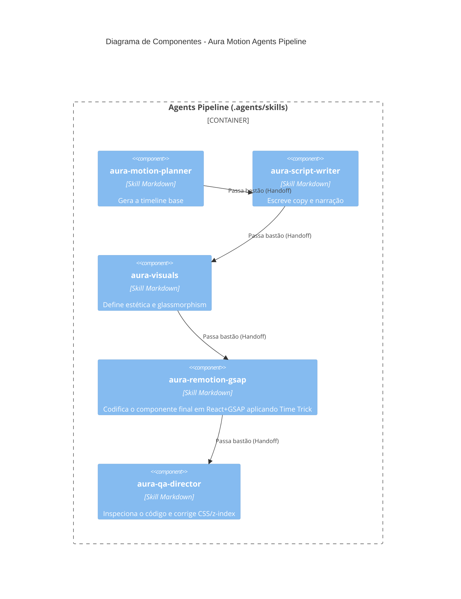

# C4 Model: Components

```mermaid
C4Component
    title Diagrama de Componentes - Aura Motion Agents Pipeline

    Container_Boundary(agents_pipeline, "Agents Pipeline (.agents/skills)") {
        Component(planner, "aura-motion-planner", "Skill Markdown", "Gera a timeline base")
        Component(scriptWriter, "aura-script-writer", "Skill Markdown", "Escreve copy e narração")
        Component(visuals, "aura-visuals", "Skill Markdown", "Define estética e glassmorphism")
        Component(remotionGsap, "aura-remotion-gsap", "Skill Markdown", "Codifica o componente final em React+GSAP aplicando Time Trick")
        Component(qaDirector, "aura-qa-director", "Skill Markdown", "Inspeciona o código e corrige CSS/z-index")
    }

    Rel(planner, scriptWriter, "Passa bastão (Handoff)")
    Rel(scriptWriter, visuals, "Passa bastão (Handoff)")
    Rel(visuals, remotionGsap, "Passa bastão (Handoff)")
    Rel(remotionGsap, qaDirector, "Passa bastão (Handoff)")
```
