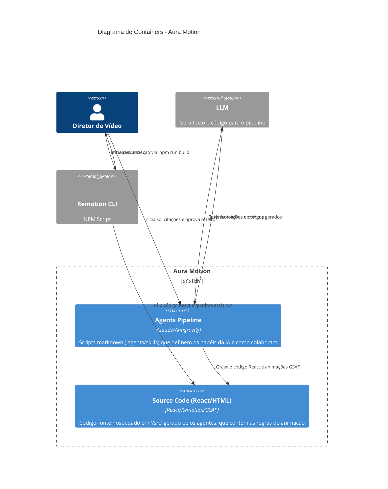

# C4 Model: Containers

```mermaid
C4Container
    title Diagrama de Containers - Aura Motion

    Person(usuario, "Diretor de Vídeo")
    
    System_Boundary(auraMotion, "Aura Motion") {
        Container(agents_pipeline, "Agents Pipeline", "Claude/Antigravity", "Scripts markdown (.agents/skills) que definem os papéis da IA e como colaboram")
        Container(remotion_src, "Source Code (React/HTML)", "React/Remotion/GSAP", "Código-fonte hospedado em '/src' gerado pelos agentes, que contém as regras de animação")
    }
    
    System_Ext(llm, "LLM", "Gera texto e código para o pipeline")
    System_Ext(remotion_cli, "Remotion CLI", "NPM Script", "Renderizador de vídeo local (usa Headless Chrome e FFmpeg)")

    Rel(usuario, agents_pipeline, "Inicia solicitações e aprova roteiros")
    Rel(agents_pipeline, llm, "Envia instruções de prompt")
    Rel(llm, agents_pipeline, "Retorna roteiros e códigos gerados")
    Rel(agents_pipeline, remotion_src, "Grava o código React e animações GSAP")
    Rel(usuario, remotion_cli, "Inicia renderização via 'npm run build'")
    Rel(remotion_cli, remotion_src, "Lê o código React e quadros estáticos")
    Rel(remotion_cli, usuario, "Entrega o .mp4")
```
