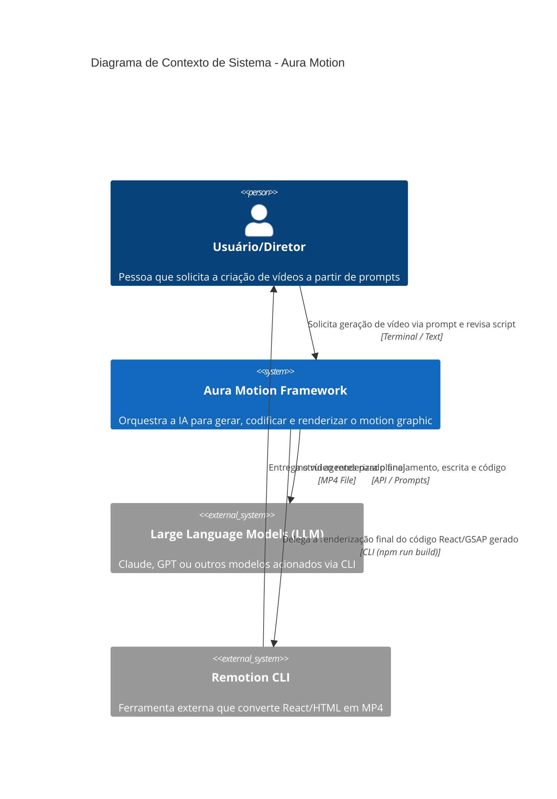

# C4 Model: Contexto

```mermaid
C4Context
    title Diagrama de Contexto de Sistema - Aura Motion

    Person(usuario, "Usuário/Diretor", "Pessoa que solicita a criação de vídeos a partir de prompts")

    System(auraMotion, "Aura Motion Framework", "Orquestra a IA para gerar, codificar e renderizar o motion graphic")

    System_Ext(llm, "Large Language Models (LLM)", "Claude, GPT ou outros modelos acionados via CLI")
    System_Ext(remotionEngine, "Remotion CLI", "Ferramenta externa que converte React/HTML em MP4")

    Rel(usuario, auraMotion, "Solicita geração de vídeo via prompt e revisa script", "Terminal / Text")
    Rel(auraMotion, llm, "Instrui agentes para planejamento, escrita e código", "API / Prompts")
    Rel(auraMotion, remotionEngine, "Delega a renderização final do código React/GSAP gerado", "CLI (npm run build)")
    Rel(remotionEngine, usuario, "Entrega o vídeo renderizado final", "MP4 File")
```
