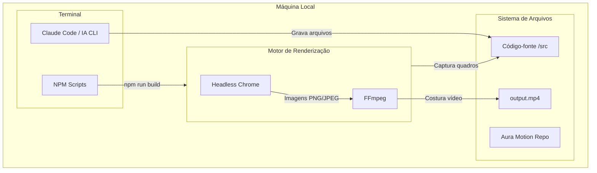

# Diagrama de Deployment — Aura Motion

A infraestrutura não reside em nuvem, mas sim no ambiente local do criador via CLI (Node.js/React).

## Configurações / Dependências
- **Node.js**: Necessário para rodar o ambiente Remotion.
- **Chrome/Chromium**: Utilizado pelo Remotion para renderizar o DOM em frames estáticos.
- **FFmpeg**: Utilizado localmente pelo Remotion para juntar os frames capturados em vídeo.

## Escala de Confiança
🟢 CONFIRMADO (Evidente pelas instruções de `create-video` e `npm run build` do Remotion)
