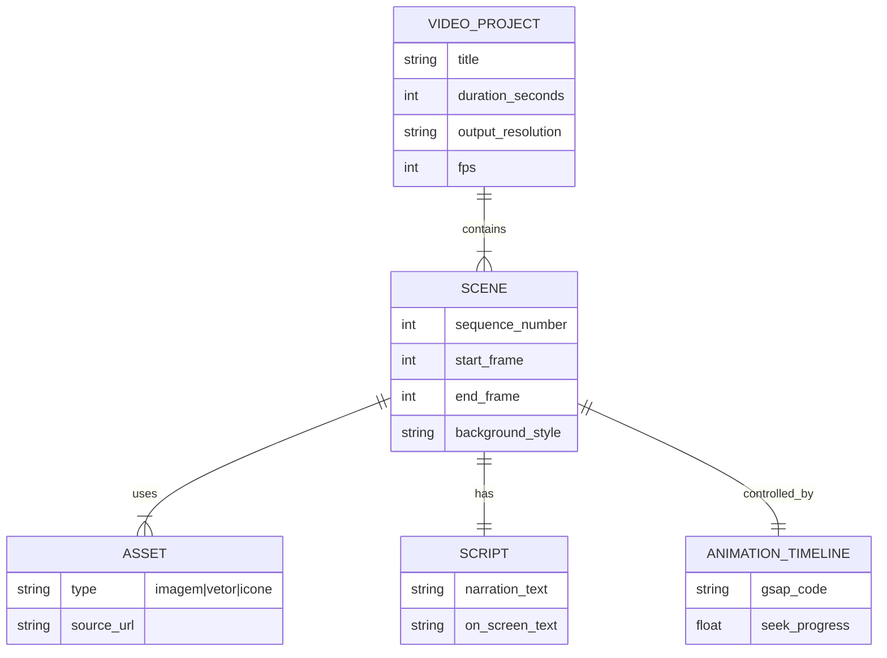

# Diagrama ERD Completo — Aura Motion

Como o Aura Motion é um framework de renderização de vídeo e pipeline automatizado (e não um sistema de gestão de dados com banco de dados), ele não armazena dados transacionais (não há tabelas). Contudo, o "schema" abstrato de como a estrutura do vídeo (Timeline) se organiza pode ser mapeado como um modelo de dados hierárquico na memória.

## Escala de Confiança
🟢 CONFIRMADO (Inferido da mecânica descrita no fluxo de roteiro e animação)
