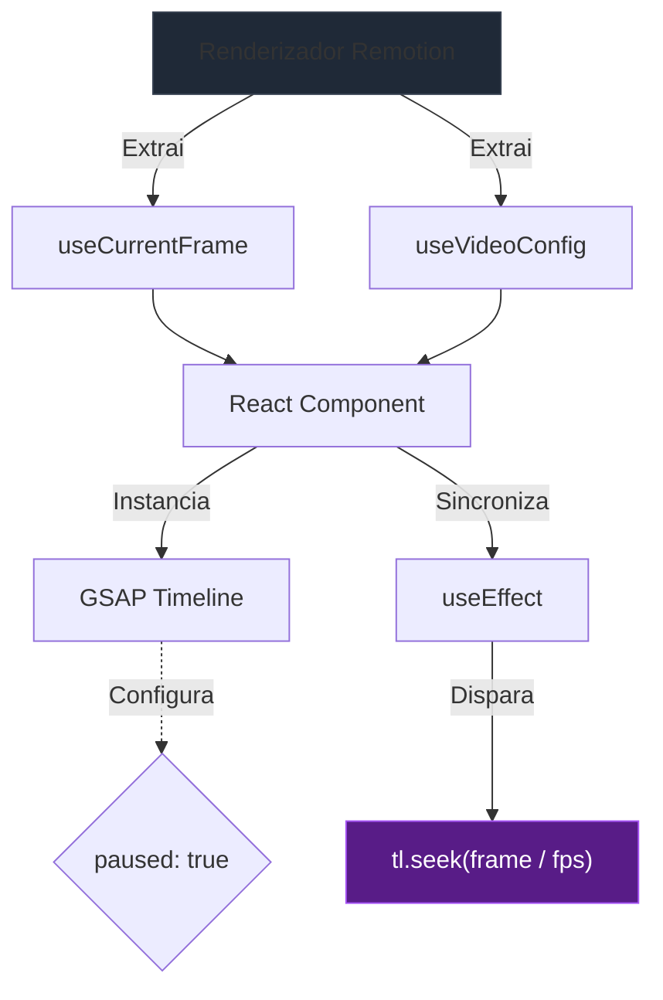

# Fluxograma: GSAP+Remotion Logic

```mermaid
graph TD
    A[Renderizador Remotion] -->|Extrai| B[useCurrentFrame]
    A -->|Extrai| C[useVideoConfig]
    B --> D[React Component]
    C --> D
    
    D -->|Instancia| E[GSAP Timeline]
    E -.->|Configura| F{paused: true}
    
    D -->|Sincroniza| G[useEffect]
    G -->|Dispara| H["tl.seek(frame / fps)"]
    
    style A fill:#1f2937,stroke:#374151
    style H fill:#581c87,stroke:#a855f7,color:#ffffff
```
