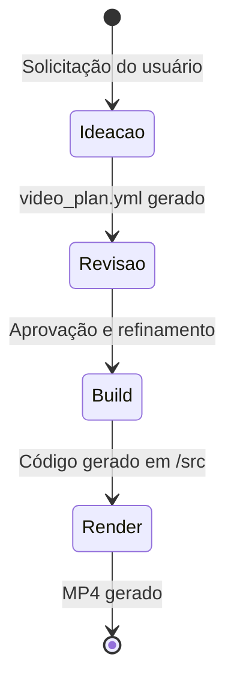

# Máquinas de Estado — Aura Motion

Como o Aura Motion é um framework de automação e renderização estática e não um software transacional, não há entidades de banco de dados tradicionais. O "Estado" aqui se refere ao ciclo de vida da produção do vídeo (Video Pipeline).

## Ciclo de Vida da Produção de Vídeo

- **Valores possíveis (Fases):** `Ideação`, `Revisão`, `Build`, `Render`
- **Gatilhos de Transição:**
  - `Nova solicitação` -> Transita para **Ideação** (Gera `video_plan.yml`)
  - `Aprovação Humana` -> Transita de **Ideação** para **Revisão** (e em seguida para **Build**)
  - `Geração de Código` -> Transita para **Build** (Agentes constroem no `/src`)
  - `Execução de CLI` -> Transita para **Render** (via `npm run build`)

## Diagrama de Estados (Pipeline)

## Escala de Confiança
🟢 CONFIRMADO
